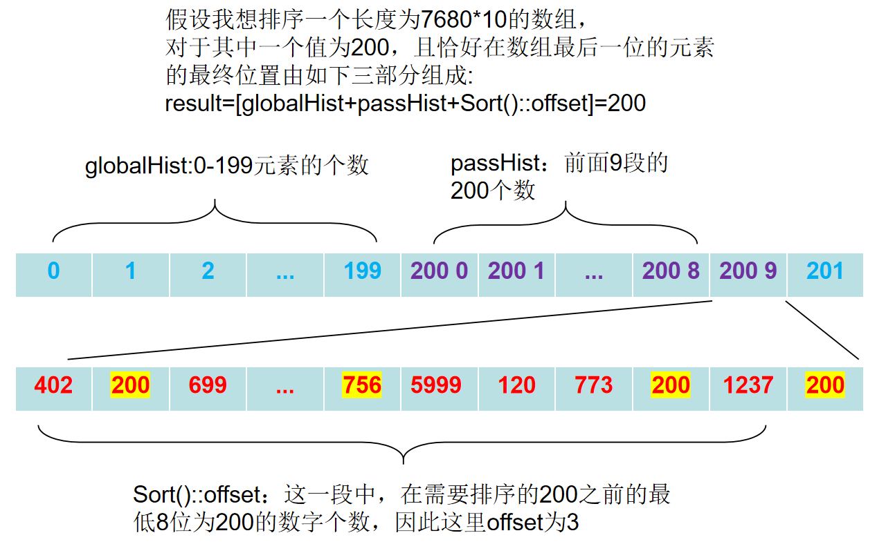
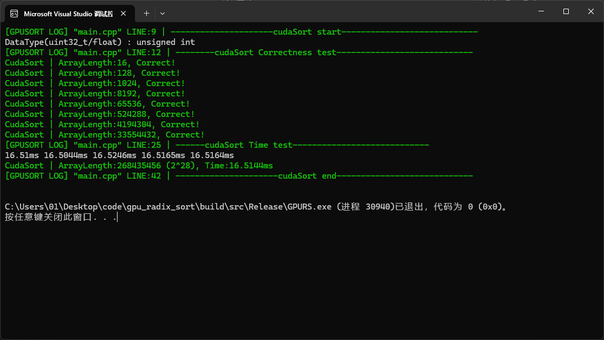
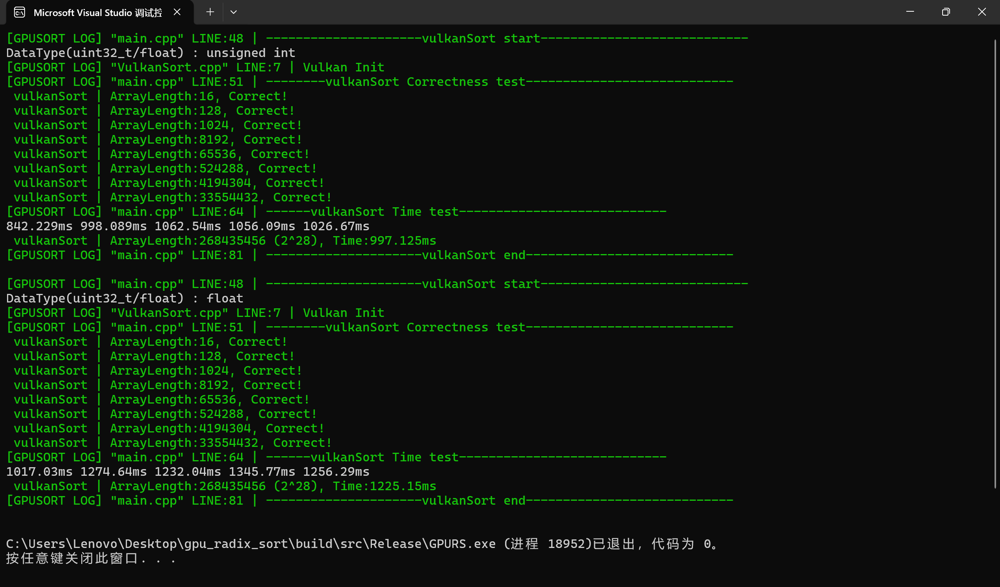

# GPU_Radix_Sort

#### 介绍

- 用Vulkan和cuda分别实现基数排序，并且进行性能对比，可是为什么我用Vulkan实现的性能这么慢啊，找不到原因。

- 介绍的csdn博客：[https://blog.csdn.net/qq_46348003/article/details/156650297?spm=1001.2014.3001.5501](https://blog.csdn.net/qq_46348003/article/details/156650297?spm=1001.2014.3001.5501)

- 借鉴了以下两个开源项目：
  
  - [https://github.com/jaesung-cs/vulkan_radix_sort](https://github.com/jaesung-cs/vulkan_radix_sort)
  - [https://github.com/b0nes164/GPUSorting](https://github.com/b0nes164/GPUSorting)

- 哔哩哔哩的这个视频以及相关的链接也给了很大的启发
  
  - [https://www.bilibili.com/video/BV1PEW4zbEKR/?spm_id_from=333.337.search-card.all.click&vd_source=80bb32e3e2afa3a6262007d27d4d75ff](https://www.bilibili.com/video/BV1PEW4zbEKR/?spm_id_from=333.337.search-card.all.click&vd_source=80bb32e3e2afa3a6262007d27d4d75ff)

- 项目的本意是用于学习并行算法和熟悉Vulkan与Cuda的使用技巧，因此重做了一遍。

- 当然这个小项目也会用在后续的3D高斯中

#### 构建

- cmake，然后直接运行就行，只有一个项目，main文件调用了接口来进行对比和展示效果。

#### 展示

- 时间性能与GPU种类，API以及数组的长度和随机范围有关。
- 对2^30个数字需要很大的显存，至少我的16G显存不够用

| RTX5080       | 2^27  | 2^28  | 2^29  | RTX3060 Laptop | 2^27  | 2^28  | 2^29  |
|:-------------:|:-----:|:-----:|:-----:|:--------------:|:-----:|:-----:|:-----:|
| cuda Uint32   | 8.478 | 16.65 | 33.29 | cuda Uint32    | 22.27 | 42.94 | 94.16 |
| cuda Float    | 11.01 | 22.16 | 43.74 | cuda Float     | 30.29 | 56.97 | 128.2 |
| Vulkan Uint32 | 420.9 | 896.1 | 1796  | Vulkan Uint32  | 591.3 | 997.1 | 1851  |
| Vulkan Float  | 456.6 | 993.2 | 1863  | Vulkan Float   | 733.1 | 1225  | 2294  |

- 在RTX5080上进行cuda测试的截图

- 在RTX3060 Laptop中 Vulkan测试截图

